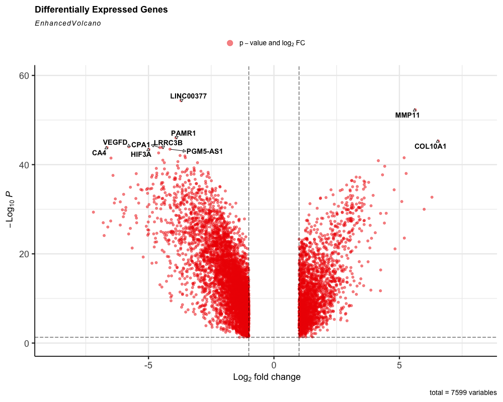
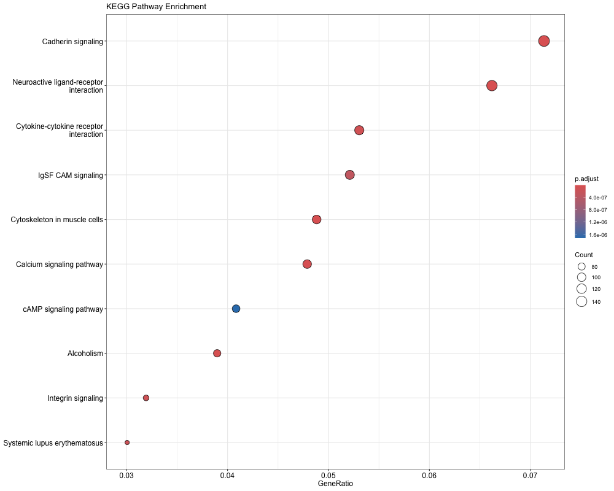
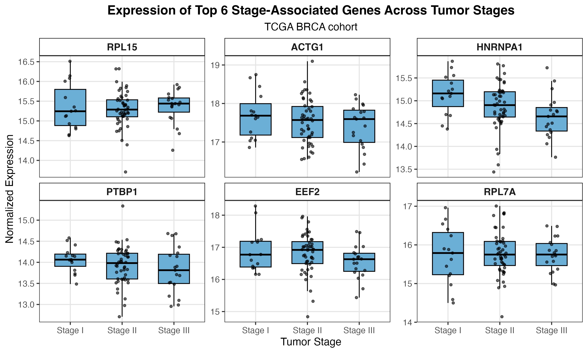
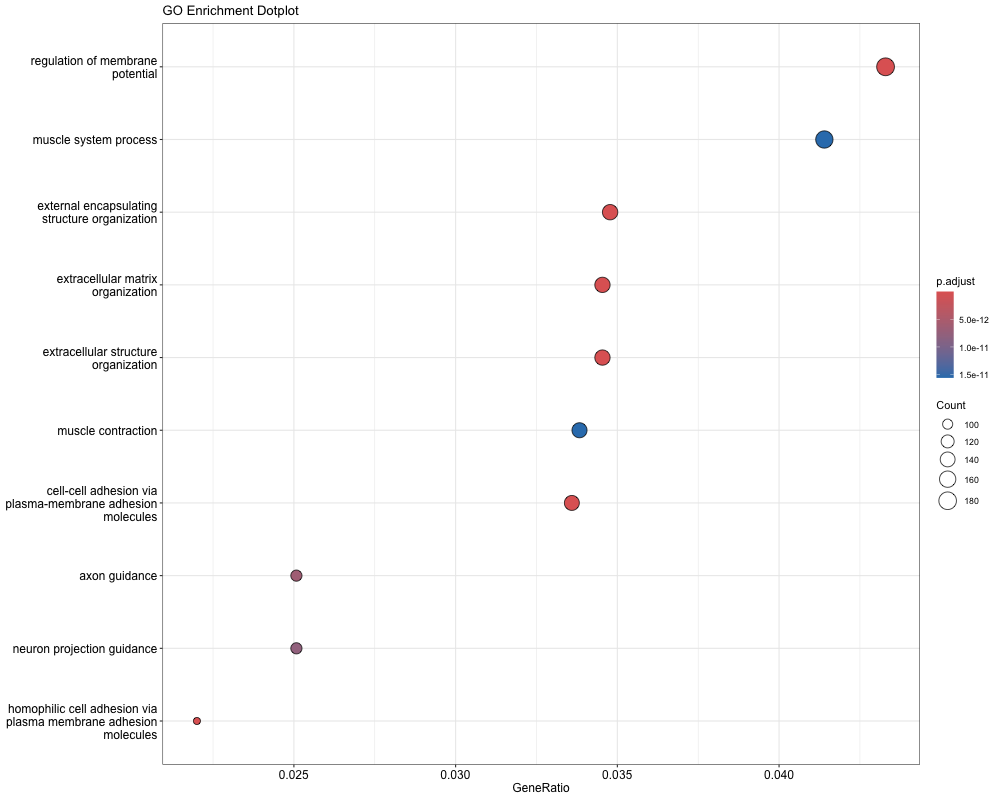
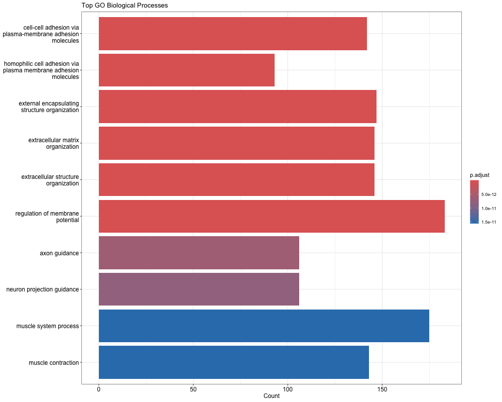
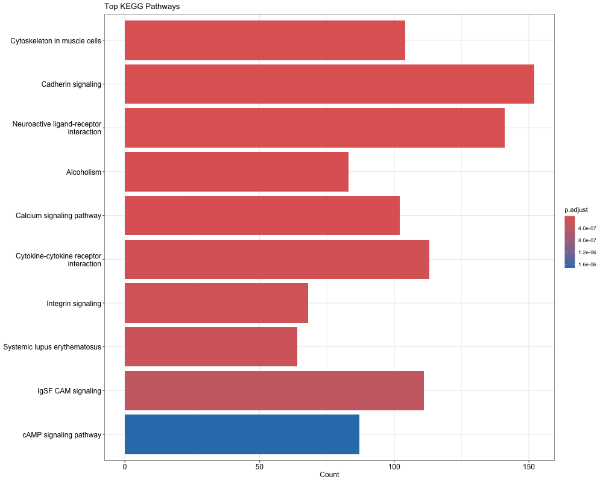
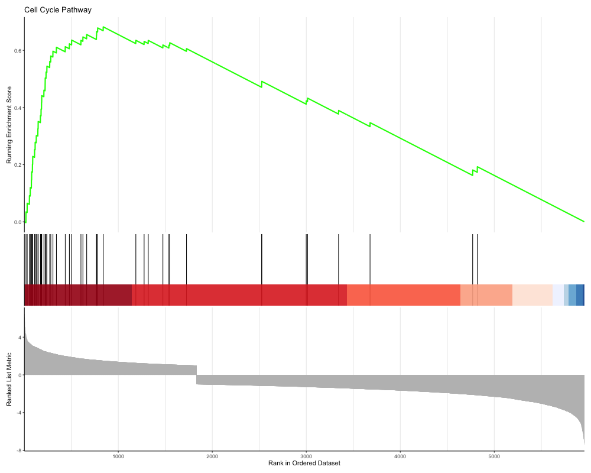
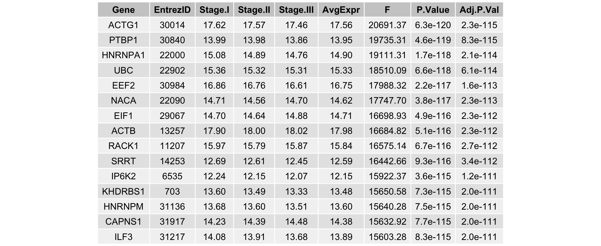

# Differential Gene Expression Analysis of Breast Cancer (TCGA BRCA)

## Overview

This project performs a comprehensive **RNA-seq differential gene expression analysis** using data from the **TCGA Breast Invasive Carcinoma (BRCA) cohort**. The goal is to identify genes and biological pathways that are significantly associated with breast cancer tumor samples compared to normal control tissue.

The analysis pipeline includes:

- Differential expression analysis using **limma**
- Visualization of gene expression changes
- Functional enrichment analysis (**Gene Ontology and KEGG**)
- **Gene Set Enrichment Analysis (GSEA)**
- Investigation of **gene expression differences across tumor stages**

This repository demonstrates a complete **bioinformatics RNA-seq analysis workflow** using R, including statistical modeling, pathway enrichment, and data visualization.

---

## Example Results

### Differential Gene Expression


### Pathway Enrichment


### Tumor Stage–Associated Gene Expression


## Dataset

This analysis uses RNA-seq gene expression data from the **GDC TCGA Breast Cancer (BRCA) cohort**, accessed through the **UCSC Xena Browser**.

### Data Source

- **Portal:** UCSC Xena Browser  
- **Xena Hub:** https://gdc.xenahubs.net  
- **Cohort:** GDC TCGA Breast Cancer (BRCA)  
- **Dataset ID:** `TCGA-BRCA.star_counts.tsv`  
- **Data type:** Gene expression RNA-seq  
- **Platform:** Illumina  
- **Unit:** log2(count + 1)

### Source Dataset Characteristics

| Feature | Value |
|------|------|
| Total samples | 1226 |
| Total genes | 60,661 |
| Data format | Gene expression matrix |
| Transformation | log2(count + 1) |

### Dataset Links

Dataset page  
https://xenabrowser.net/datapages/?cohort=GDC%20TCGA%20Breast%20Cancer%20(BRCA)

Download (STAR counts)  
https://gdc-hub.s3.us-east-1.amazonaws.com/download/TCGA-BRCA.star_counts.tsv.gz

Gene annotation mapping  
https://gdc-hub.s3.us-east-1.amazonaws.com/download/gencode.v36.annotation.gtf.gene.probemap

GDC RNA-seq pipeline documentation  
https://docs.gdc.cancer.gov/Data/Bioinformatics_Pipelines/Expression_mRNA_Pipeline/

### Processing Notes from the GDC Pipeline

According to the Genomic Data Commons documentation:

- RNA-seq counts were generated using the **GDC STAR pipeline**
- Data originating from the same biological sample but different **vials/portions/analytes/aliquots** were averaged
- Expression values were transformed using:

```
log2(count + 1)
```

Data is organized as:

- **Rows:** genes / identifiers  
- **Columns:** samples  

---

## Project-Specific Data Processing

The full TCGA BRCA dataset contains **1226 samples**. For this project, a curated subset was selected to perform balanced tumor-vs-control analysis.

### Final analysis dataset

| Group | Samples |
|------|------|
| Tumor | 82 |
| Control | 82 |

Group classification follows **TCGA sample-type conventions**:

| Code | Sample Type |
|----|----|
| 01A | Primary tumor |
| 11A | Solid tissue normal |

The expression data was filtered and aligned with clinical metadata to produce the project analysis files.

---

## Repository Structure

```
breast-cancer-deg-analysis/

data/
    filtered_counts_v2.csv
    filtered_counts.csv
    metadata_v2.csv
    metadata.csv

figures/
    volcano_plot.png
    logFC_distribution.png
    GO_barplot.png
    GO_dotplot.png
    KEGG_barplot.png
    KEGG_dotplot.png
    GSEA_KEGG_dotplot.png
    GSEA_CellCycle_Enrichment.png
    Top6_Genes_Boxplot.png
    Top15_Stage_Associated_Genes.png

notebooks/
    tcga_brca_deg_analysis.ipynb

results/
    all_DEG_results.csv
    differential_expression_results.csv
    filtered_DEGs.csv
    genes_added_pipeline.csv
    genes_removed_pipeline.csv
    GSEA_KEGG_results.csv
    KEGG_enrichment_results.csv
    PCA_2D_Cancer_vs_Control.png
    sample_correlation_clustermap.png
    top_kegg_pathways.png
    Top10_Genes.docx
    tumor_stage_overall_F_test_results.csv
    volcano_plot.png

scripts/
    tcga_brca_limma_pipeline.R

README.md
```

---

## Analysis Pipeline

### Differential Gene Expression

Differential gene expression analysis was performed using the **limma** package.

Model:

```
Expression ~ Group
```

Where:

- Group = Tumor vs Control

Significance criteria:

```
FDR < 0.05
|log2 Fold Change| > 1
```

Output:

```
results/filtered_DEGs.csv
```

---

## Functional Enrichment Analysis

Differentially expressed genes were analyzed for biological enrichment using **clusterProfiler**.

---

## Gene Ontology (GO)

GO analysis identifies biological processes associated with differentially expressed genes.





---

## KEGG Pathway Enrichment

KEGG enrichment analysis identifies biological pathways significantly associated with breast cancer gene expression changes.




Results exported to:

```
results/KEGG_enrichment_results.csv
```

---

## Gene Set Enrichment Analysis (GSEA)

GSEA was performed using ranked gene fold-change values to detect pathway-level expression changes.

Example enriched pathway:

### Cell Cycle Pathway



Results exported to:

```
results/GSEA_KEGG_results.csv
```

---

## Tumor Stage Analysis

Expression differences were also examined across tumor stages.

Stages analyzed:

- Stage I
- Stage II
- Stage III

Stage IV was excluded due to insufficient sample size.

Linear modeling was performed using **limma** to identify genes associated with tumor stage progression.

Output:

```
results/tumor_stage_overall_F_test_results.csv
```

---

## Top Stage-Associated Genes

The following genes show the strongest association with tumor stage progression.



---

## Expression Patterns of Key Genes

Expression levels of the top stage-associated genes across tumor stages.


---

## Technologies Used

### Programming Languages

- R
- Python

### R Packages

- limma
- clusterProfiler
- org.Hs.eg.db
- enrichplot
- EnhancedVolcano
- ggplot2
- dplyr
- reshape2
- officer
- flextable

### Bioinformatics Methods

- RNA-seq differential expression analysis
- Functional enrichment analysis
- KEGG pathway analysis
- Gene Set Enrichment Analysis
- Tumor stage modeling

---

## Reproducibility

### Install required R packages

```r
install.packages(c(
"limma",
"dplyr",
"EnhancedVolcano",
"clusterProfiler",
"org.Hs.eg.db",
"enrichplot",
"ggplot2",
"reshape2",
"officer",
"flextable"
))
```

### Run the analysis

```
scripts/tcga_brca_limma_pipeline.R
```

Outputs will automatically be generated in:

```
figures/
results/
```

---

## Author

Nicholas Lucido  

M.S. in Biological Data Science  
Arizona State University

---

## Future Improvements

Possible extensions of this analysis include:

- survival analysis of significant genes
- integration with additional TCGA clinical variables
- machine learning classification models
- multi-omics analysis
- biomarker discovery pipelines

---

## License

This project is intended for research and educational purposes.
